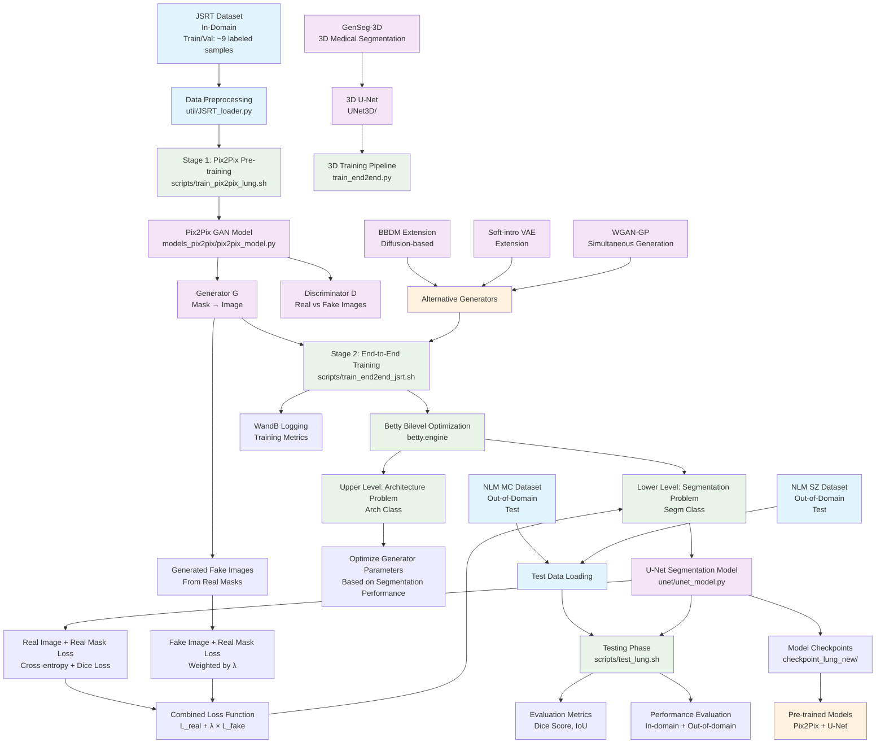

# GenSeg Framework Architecture

This diagram illustrates how the GenSeg (Generative AI for Medical Image Segmentation) framework works in ultra low-data regimes.

## Key Components Explained:

### 1. **Two-Stage Training Process**
- **Stage 1**: Pre-train Pix2Pix GAN on limited labeled data (mask→image generation)
- **Stage 2**: End-to-end training using Betty bilevel optimization framework

### 2. **Bilevel Optimization (Betty Framework)**
- **Upper Level**: Optimizes generator parameters based on segmentation performance
- **Lower Level**: Trains segmentation model using both real and generated data
- **Key Innovation**: Generator learns to create images that improve segmentation

### 3. **Data Augmentation Strategy**
- Uses real masks to generate synthetic images via trained Pix2Pix
- Combines real image-mask pairs with synthetic image-real mask pairs
- Loss weighting parameter λ controls synthetic data contribution

### 4. **Architecture Flexibility**
- **Segmentation Models**: U-Net, DeepLab, DeepLabV2, Swin-UNet
- **Generative Models**: Pix2Pix (default), BBDM (diffusion), Soft-intro VAE
- **Extensions**: 3D segmentation, simultaneous image-mask generation

### 5. **Evaluation Strategy**
- **In-domain**: JSRT dataset (lung segmentation)
- **Out-of-domain**: NLM MC and NLM SZ datasets
- **Metrics**: Dice Score, IoU
- **Ultra low-data**: Trained with only 9 labeled samples

This framework enables effective medical image segmentation even with extremely limited labeled data by leveraging generative AI for intelligent data augmentation.